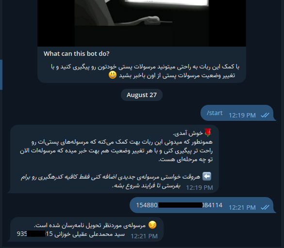

# ربات پیگیری مرسولات پستی

-------------------
توی این پروژه سعی کردم خیلی ساده کد بزنم و از پروژه [Node.Ts][node.ts] استفاده کردم.
به طور کلی از پکیج های
- [Axios](axios)
- [Cheerio](cheerio)
- [Express](express)
- [Node-cron](node-cron)
- [Pg](pg)
- [Pino](pino)
- [Pug](pug)
- [Typeorm](typeorm)

[ربات][bot] هیچ دستور گیج کننده‌ای نداره و خیلی راحت میتونید بعد از دستور /start شروع به ارسال کد های پیگیری خودتون کنید

-----------------

-----------------

هیچ اطلاعاتی از کاربر ثبت نمیشه بجز اطلاعاتی که تلگرام در اختیار ربات میذاره و اگر اطلاعات کاربر نباشه برای پیام دادن به کاربر به مشکل می‌خوریم اگر بخوایم تغییر وضعیت رو به کاربر اطلاع رسانی کنیم و برای همین اطلاعات کاربر مثل

1. Username
2. Firstname
3. Lastname
4. ChatId

بعد از تکمیل فرایند تمامی رکوردهای مربوط به مرسوله هم حذف میشه.

[node.ts]: https://github.com/RezaParsian/Node.Ts
[axios]: https://axios-http.com
[cheerio]: https://cheerio.js.org/
[express]: https://expressjs.com/
[node-cron]: https://github.com/node-cron/node-cron
[pg]: https://node-postgres.com/
[pino]: https://getpino.io/
[pug]: https://pugjs.org
[typeorm]: https://typeorm.io/
[bot]: https://t.me/Post_trackerbot